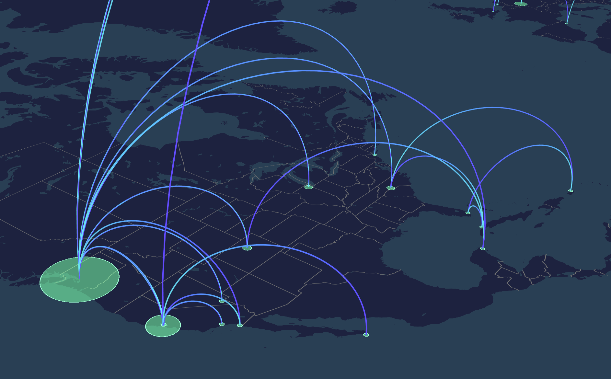

# Flight Map
A map of my flight history throughout 2017 and 2018.

Live version available at: [projects.dylanbabbs.com/flight-map](https://projects.dylanbabbs.com/flight-map)

## Made with
- [HERE XYZ](https://www.here.xyz/)
- [Uber Deck.gl](http://deck.gl)
- [Mapbox GL JS](https://github.com/mapbox/mapbox-gl-js)
- [HERE Location Services (Geocoder)](http://developer.here.com)
- Open Street Map [(served from HERE XYZ)](https://www.here.xyz/)

## Data

Flight data was gathered manually by sorting through my email. In the future, I hope to automate this process.

Using the Jupyter notebook script inside the `data` directory, I converted my csv into geojson. Throughout this conversion process, airport locations are  geocoded into coordinates and the distance between the two airports is also calculated. The geojson is then uploaded to and stored in an [XYZ space](https://www.here.xyz/).
